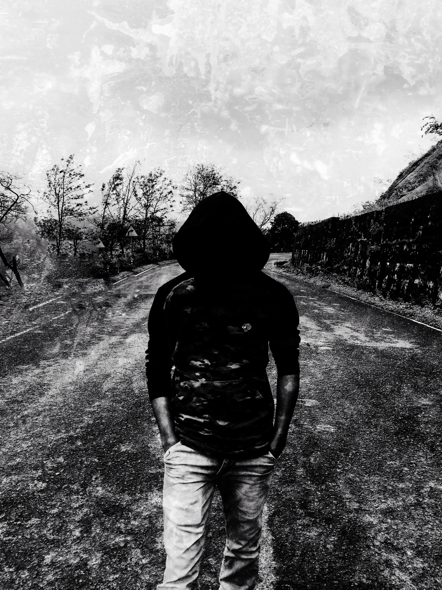

# About-me
You can find my **Repository links** below:
- [Source Repository link](https://github.com/prasu93/about-me)
- [Hosted Page link](https://prasu93.github.io/about-me/)
## About this Repo:
This repo is made majorly for two things
1. To know about [me](https://github.com/prasu93/)
2. To provide best resources or materials and efficient tutorials to the people, who are planning to make their way to the **Web-Development**
## Tools Recommended:
The preferred languages that you can use for developing github pages are:
- Markdown Language
- Hyper Text Markup Language, popularly known as HTML

People use Javascript, Ruby and other languages for performing some additional action items or applying few constraints for the web pages.

Links for your reference: [Markdown](https://www.markdownguide.org/basic-syntax/) and [HTML](https://www.w3schools.com/html/)

**Note**: Any efficient browser is fine and I would recommend [Google Chrome](https://www.google.com/chrome/?brand=CHBD&gclid=CjwKCAjwqZPrBRBnEiwAmNJsNqOXRmog_4r60cVSsTN0Im_qLZvh__imowYwKzZAY1CSuz63h-lwPhoCV5gQAvD_BwE&gclsrc=aw.ds)(Windows) for publishing Github pages  because I'm using it :-)
## Recommended Resources:
The best resources, which I prefer for Web-development are:
1. [Full stack Web-developer](https://github.com/bmorelli25/Become-A-Full-Stack-Web-Developer)
2. The one which is already mentioned in the module itself. Click [here](https://github.com/kamranahmedse/developer-roadmap)
3. [Video Tutorial for Web-development](https://www.youtube.com/watch?v=3JluqTojuME)
4. [How to make a simple Github page](https://www.youtube.com/watch?v=BA_c3bGQXlQ)
## Contributors:
I'm Prasanna Kumar, came all the way from [Vizag](https://en.wikipedia.org/wiki/Visakhapatnam) - The City of Destiny, located in India. Currently pursuing masters in Applied Computer Science from NWMSU.

I have an experience of 3.5 years in [Wipro Technologies](https://en.wikipedia.org/wiki/Wipro) as Project Engineer, where I had worked on Unix Shell Scripting and a bit on Python.

I would like to post one of my picture, but not favorite, which was captured when I'm on my way to [Lonavala](https://en.wikipedia.org/wiki/Lonavla)(Pune, India)

